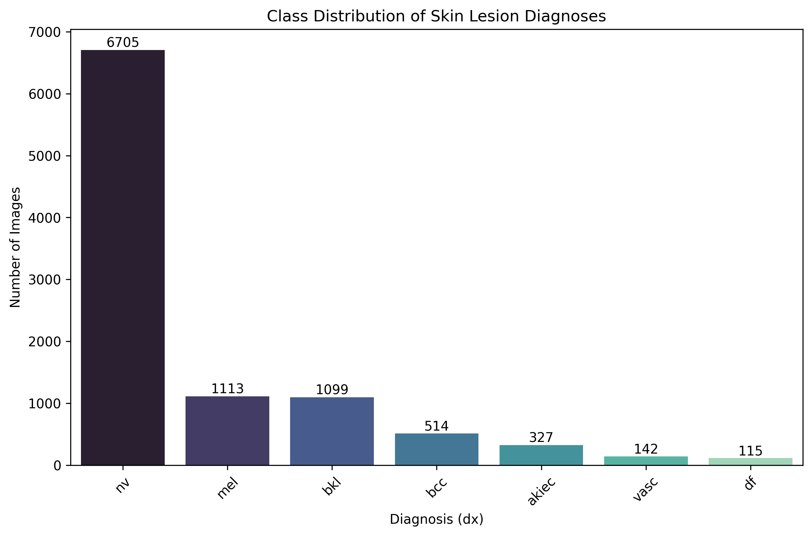
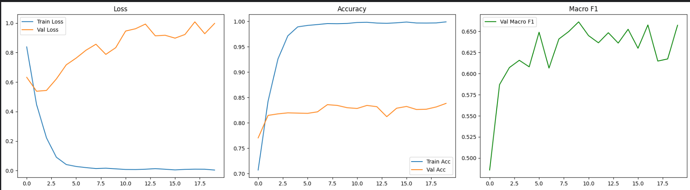
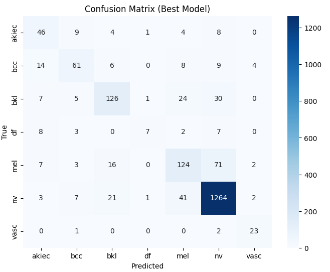
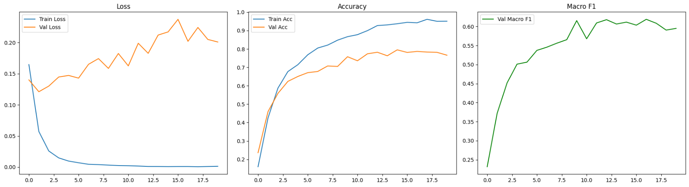
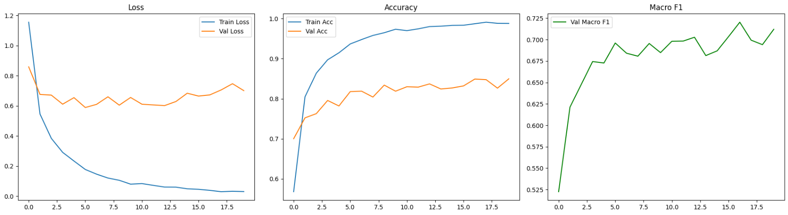
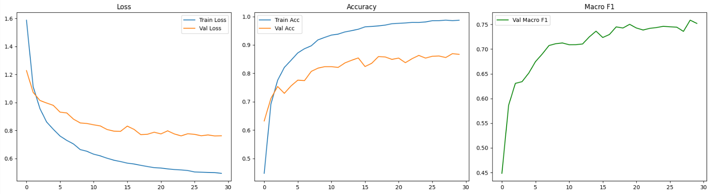
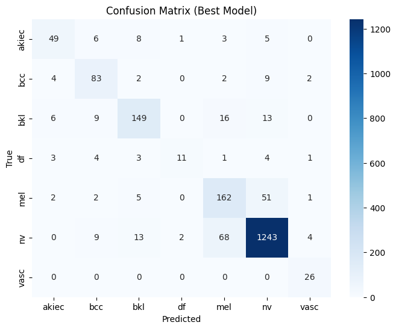
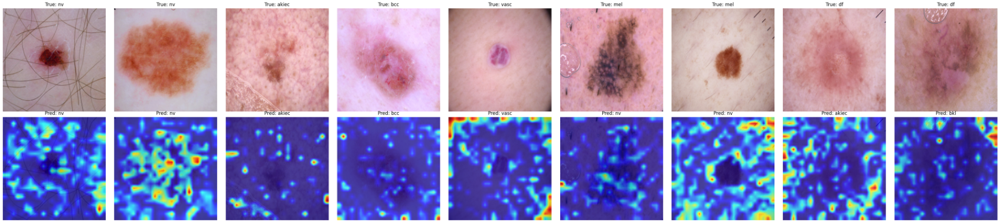

# HAM10000 Skin Lesion Classification

A 7-class dermoscopic image classifier built on the *HAM10000* dataset, with a focus on **handling severe class imbalance** and **interpretability**. Not just chasing accuracy.

## 1. Problem
Skin lesion classification from dermoscopic images is a well-studied but genuinely hard problem: 
- 7 diagnostic categories, one of which (melanocytic nevi `nv`, benign) dominates **~67%** of the data, while the clinically important classes — melanoma `mel`, basal cell carcinoma `bcc`, dermatofibroma `df` — are comparatively rare.

- A naive classifier can hit high accuracy by defaulting toward the majority class while failing exactly where it matters most: distinguishing malignant lesions from benign look-alikes.
 
This project builds a classifier on top of **EfficientNet-B4**, with the explicit **goal of improving macro-averaged F1** (treats all 7 classes equally) rather than raw accuracy, since accuracy is a misleading metric on this dataset.

## 2. Dataset
**HAM10000** ("Human Against Machine with 10000 training images") — 10,015 dermoscopic images across 7 classes:

Dataset Link - https://www.kaggle.com/datasets/kmader/skin-cancer-mnist-ham10000 \
Original Challenge - https://challenge.isic-archive.com/landing/2018/47/

| Class   | Full name            | Train count | Approx. % |
|---      |---                   |---          |---        |
| `akiec` | Actinic keratoses    | 255         | 3.2%      |
| `bcc`   | Basal cell carcinoma | 412         | 5.1%      |
| `bkl`   | Benign keratosis     | 906         | 11.3%     |
| `df`    | Dermatofibroma       | 88          | 1.1%      |
| `mel`   | Melanoma             | 890         | 11.1%     |
| `nv`    | Melanocytic nevi     | 5,366       | 66.8%     |
| `vasc`  | Vascular lesions     | 116         | 1.4%      |

## 3. Approach
> Every phase changed exactly one variable from the previous phase, to keep results attributable.

### Split Strategy
- A critical detail in this dataset is that a single lesion (`lesion_id`) can have multiple images (`image_id`) — up to 6 images per lesion, from different angles/zoom levels.
- A naive random split at the image level leaks the same lesion across train and validation, inflating validation metrics. This project uses `StratifiedGroupKFold` (grouped by `lesion_id`, stratified by diagnosis class), producing an 80/20 split with zero lesion overlap between train and val — verified with an explicit assertion before any training began.

### Phase 1 - Baseline

EfficientNet-B4 (ImageNet pretrained) \
plain cross-entropy loss \
**no** imbalance handling \
**no** augmentation \
AdamW (lr=1e-4)  \
20 epochs \
mixed precision 

**Result: macro F1 = 0.658.** The model performed well on `nv` (F1 0.926) but collapsed on minority classes — `akiec`, `df`, `mel`, `vasc` all scored near zero recall in early debugging (later traced to a normalization bug in evaluation, not the model itself — *see Appendix 1*). Once corrected, the honest baseline showed **real but weak signal on rare classes** and **clear overfitting** (train accuracy ~99.8%, rising validation loss from epoch ~2).

### Phase 2 - Addressing imbalance and Overfitting

**Three approaches were tested, in isolation, against this baseline:**

1. **Focal Loss (rejected)**
   - Tried γ=2 (standard) and γ=1 (tuned down after γ=2 caused unstable, near-random early training).
   - Even after fixing alpha-weighting instability, focal loss underperformed the CE baseline overall (macro F1 0.619 vs 0.658)
   - **Critically** made the worst class **worse**: `df` recall dropped from 0.259 to 0.222.
   - With only 88 training samples for `df`, focal loss's easy-example suppression didn't have enough rare-class gradient signal to compound into better learning; it mostly redistributed error rather than fixing the core problem.

   

2. **Oversampling + Augmentation (adopted)**
   - `WeightedRandomSampler` (inverse class frequency)
   - live augmentation (horizontal/vertical flip, rotation, mild color jitter — no hue shift, since color is diagnostically meaningful in dermoscopy) to avoid the model memorizing repeated identical minority-class images.
   - This was tested against plain CE loss to isolate the effect of data-level rebalancing from loss-function changes.

   **Result: macro F1 = 0.720.** Real, broad improvement — `df` recall roughly doubled (0.259 → 0.407), and no class regressed relative to baseline.

   

3. **Dropout + Regularization (adopted)**
   - Added on top of the oversampling+augmentation setup: `drop_rate=0.3`, `drop_path_rate=0.2` (stochastic depth), `weight_decay` increased 10x (1e-4 → 1e-3), and label smoothing (0.1)
   - Extended to 30 epochs since **regularized training converges more slowly**.

    **Result: macro F1 = 0.7586.** The train/validation **loss gap narrowed** and **validation F1 became visibly more stable** across epochs (less oscillation in the final 10 epochs vs. the un-regularized oversampling run). `df` recall **did not** improve further (stayed at 0.407) — by this point the limiting factor for `df` is very likely **dataset size** (27 validation samples total) rather than model capacity or regularization.

    
    

**Weighted CE was NOT tested separately** - Given time constraints and that data-level rebalancing (oversampling) already outperformed the one loss-level intervention tried (focal loss), a fourth isolated experiment was judged low-value relative to consolidating the phase.

### Phase 3 - Test-Time Augmentation (TTA) and interpretability

**TTA (adopted).** Averaged softmax predictions across 5 views per validation image (original, horizontal flip, vertical flip, 90°/270° rotation).

**Result: macro F1 = 0.7625** (+0.0039 over the non-TTA model). A modest but real and free improvement — kept in the final inference pipeline since it costs only extra inference compute, no retraining.

**Grad-CAM.** Used `pytorch-grad-cam` to visualize which regions of an image drove each prediction. This required iterating on the target layer: the final `conv_head` layer (and the architecturally-similar `blocks[5]`) produced a spatially tiny 12×12 feature map that, once upsampled for display, **showed a fixed artifact hotspot** in the same image corner **regardless of actual lesion location** — a resolution artifact, **not a real finding**. \
Moving to `blocks[3]` (24×24, but this specific model's earlier stage) produced **coherent, lesion-centered attention** on well-defined lesions.

## 4. Results

| Experiment                                             | Macro F1   | Notes |
|---|---|---|
| Phase 1: Baseline (CE, no imbalance handling)          | 0.658      | Strong on `nv`, weak on rare classes |
| Phase 2a: Focal loss (γ=1, capped alpha)               | 0.619      | **Rejected** — underperformed baseline, hurt `df` specifically |
| Phase 2b: Oversampling + augmentation                  | 0.720      | Broad improvement, `df` recall 0.26→0.41 |
| Phase 2c: + dropout, weight decay, label smoothing     | 0.7586     | More stable training, narrower train/val gap |
| Phase 3: + TTA (final)                                 | **0.7625** | Small additional gain, adopted for final pipeline |

### Per-class F1, baseline vs. final
 
| Class | Phase 1 (baseline) | Final (TTA) | Δ      |
|---    |---                 |---          |---     |
| akiec | 0.586              | 0.693       | +0.107 |
| bcc   | 0.639              | 0.771       | +0.132 |
| bkl   | 0.689              | 0.808       | +0.119 |
| df    | 0.378              | 0.585       | +0.207 |
| mel   | 0.582              | 0.665       | +0.083 |
| nv    | 0.926              | 0.933       | +0.007 |
| vasc  | 0.807              | 0.881       | +0.074 |

### Confusion analysis
The single largest error type across all experiments is **`mel` → `nv`** (melanoma predicted as benign nevus), consistently 55-70 cases depending on the run. This is the **most clinically important failure** mode in the entire project: 
- A **false-negative on melanoma** is the **highest-stakes error** a triage-assist model can make. 
- The model's `mel` recall (0.726 with TTA) means **roughly 1 in 4 melanomas** in validation are still **misclassified**, disproportionately toward the benign `nv` class 
- A pattern consistent with the visual overlap between atypical nevi and early melanoma, a known hard problem in dermatology itself, not unique to this model.
 
The second most common confusion is `bkl` (benign keratosis) with `nv` and `mel` - expected, since `bkl` sits visually (*from EDA*) between the two.

## 5. Known Limitations

- **`df` and `vasc` validation metrics are statistically noisy.** With only 27 and 26 validation samples respectively, a difference of 2-3 predictions swings F1 by several points. Treat these numbers as directional, not precise.
- **`mel` → `nv` remains the most important unsolved failure mode.** This model is a portfolio/learning project, not a clinical tool, but if it were extended toward real use, this specific error type would need dedicated attention (e.g., a melanoma-vs-rest binary secondary classifier, or asymmetric loss penalizing this specific confusion more heavily).
- **Grad-CAM attention is diffuse/less interpretable on images with dense hair artifacts or low lesion-background contrast**, particularly some `nv` and `mel` cases. It localizes well on clear-bordered, high-contrast lesions. This is a genuine model/method limitation worth disclosing, not a visualization bug — even dermatologists rely on more than a single image (patient history, lesion evolution over time) for ambiguous cases.
- **Single train/val split, no k-fold cross-validation.** Results reflect one lesion-grouped stratified split; a more rigorous evaluation would average over multiple folds, particularly to get more stable estimates for the small classes.
- **Focal loss's underperformance is reported as a specific, negative finding** for this dataset's imbalance profile (max ~60:1 ratio) — this should not be generalized to datasets with more extreme imbalance (e.g., 100:1+), where focal loss's original design target more directly applies.

## Appendix — debugging
 
A few bugs surfaced during this project that materially affected intermediate results, kept here for transparency:
 
1. **Missing normalization in an early evaluation cell** produced a classification report showing near-total collapse to the majority class, contradicting the training loop's own logged F1. Root cause: the eval cell fed raw `[0,1]` pixel values to a model trained exclusively on ImageNet-normalized inputs. Fixed by applying the same `(image - mean) / std` step used in training.
2. **A typo (`-` instead of `/`) in a later validation function** silently invalidated an entire 20-epoch run's in-loop F1 tracking (and therefore its best-checkpoint selection), while a separately-computed classification report on the same checkpoint showed the true, much better result. Re-run with the fix before trusting any epoch-selection logic downstream.
3. **A non-functional TTA implementation** initially averaged 5 identical (unaugmented) predictions due to a variable name reused incorrectly, silently returning the same result as no-TTA. Caught by checking the code rather than accepting a suspiciously-exact match to the baseline number.

These are included deliberately — catching and correctly diagnosing silent bugs (rather than accepting plausible-looking wrong numbers) was as much a part of this project as the modeling choices.